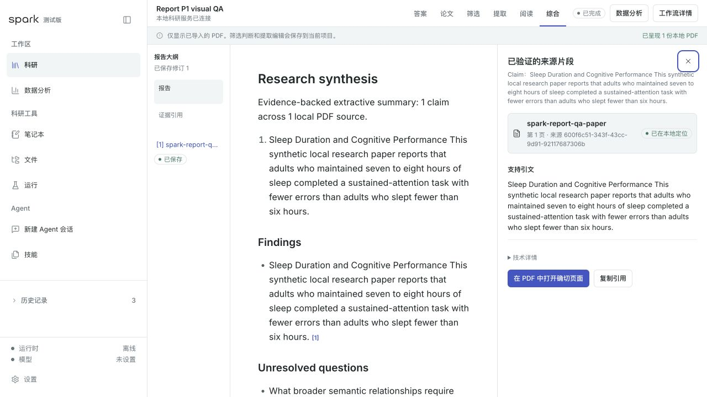
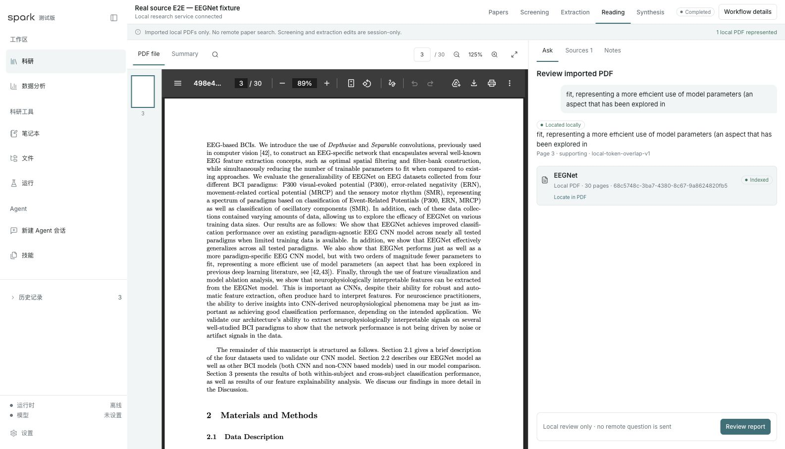
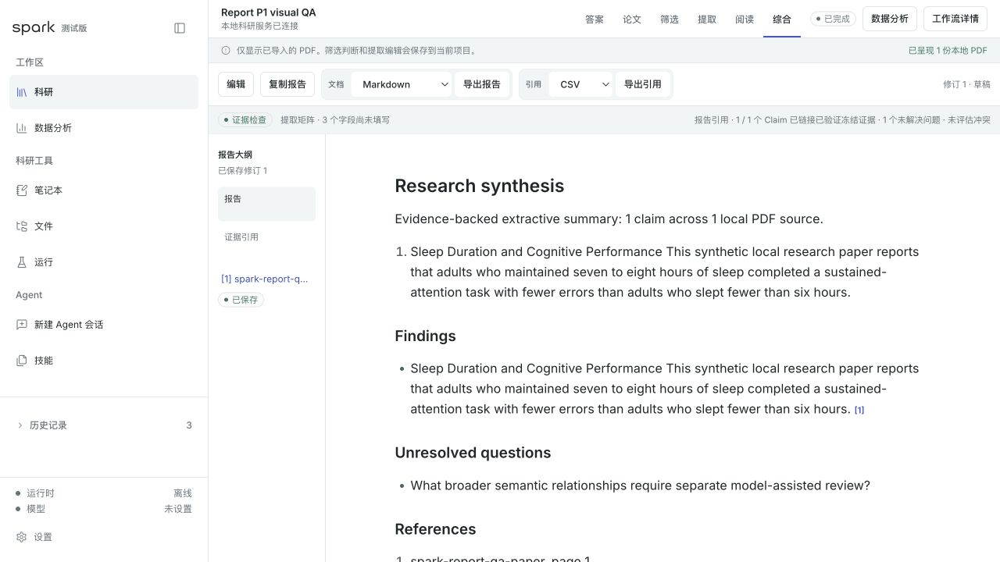
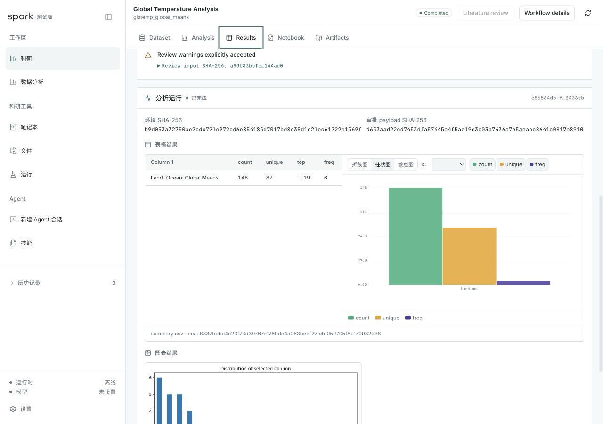

<h1 align="center">Spark Agent</h1>

<p align="center">
  <strong>From an approved research plan to screened papers, page-level evidence, and an editable cited report.</strong>
</p>

<p align="center">A local-first research workspace for macOS.</p>

<p align="center">
  <a href="https://github.com/shawliu998/spark-agent/releases/latest"></a>
  <a href="https://github.com/shawliu998/spark-agent/actions/workflows/build.yml"></a>
  <a href="LICENSE"></a>
</p>

<p align="center">
  <a href="#download">Download</a> ·
  <a href="#what-you-do">Workflow</a> ·
  <a href="#a-look-inside">Product tour</a> ·
  <a href="#what-i-led">My role</a> ·
  <a href="#build-from-source">Build from source</a>
</p>

<p align="center">
  
</p>

<p align="center"><sub>An editable report beside the exact source passage that supports it.</sub></p>

## What is this, really?

Spark Agent helps a researcher move from a question to a report without hiding
the work inside a chat transcript. You approve the exact scope and plan; a
durable, bounded research agent then executes one approved step at a time,
preserves what happened, and stops when it needs a human decision.

The result is not a single generated answer. It is a reviewable chain of
discovery records, screening decisions, local PDFs, exact-page quotations, an
extraction matrix, analysis artifacts, and an editable report with citations.

## Why

Research work is usually split across search tabs, spreadsheets, PDF readers,
notebooks, and writing tools. The researcher carries the context between them,
while a chat history is a weak record of what was searched, excluded, quoted,
or changed.

Spark makes the research artifacts the product record. The agent advances
bounded work from real workspace state; the researcher remains responsible for
scope, screening, interpretation, and conclusions.

## What you do

```text
Ask a bounded question
  -> approve the exact providers, queries, budget, and stopping policy
  -> review and screen the candidate papers
  -> attach and read local PDFs
  -> save verbatim evidence with the exact page
  -> compare extracted findings
  -> edit and export a cited report
```

Inside that approved envelope, the Research Agent can choose the next allowed
query, observe novelty and evidence coverage, retry a known-safe failure, stop
early, or ask for a revised plan. It cannot add a provider, widen a query,
increase a budget, grant itself a permission, screen a paper, or make the final
scientific conclusion.

Every meaningful step is preserved as structured state rather than left in a
transcript:

```text
understand -> plan -> act -> observe -> decide -> continue / ask / stop
                                                        |
                                                        v
                                               verify and preserve
```

## Three research stories

### Build a literature set without handing over screening

Approve the exact question, query set, provider set, result budget, and stopping
policy. Spark runs bounded Crossref and OpenAlex discovery, normalizes and
deduplicates candidates, and lets the researcher mark each one as Include,
Exclude, or Awaiting before it can enter the evidence set.

### Trace a report sentence back to the page

Save a verbatim passage from a local PDF with its exact page. Carry that evidence
through extraction and writing, then reopen the supporting passage directly from
the report citation.

### Resume a study without reconstructing the session

Approved plans, completed steps, artifacts, failures, and pending decisions are
durable project state. A provider interruption or application restart does not
turn the workflow into a guessing exercise.

## A look inside

<table>
  <tr>
    <td width="50%">
      
    </td>
    <td width="50%">
      
    </td>
  </tr>
  <tr>
    <td valign="top">
      <strong>Read with the evidence in view.</strong><br />
      Save a verbatim passage from a local PDF with the exact page attached.
    </td>
    <td valign="top">
      <strong>Write a report, not a chat answer.</strong><br />
      Edit the synthesis and export the document and its citation records separately.
    </td>
  </tr>
  <tr>
    <td colspan="2">
      
    </td>
  </tr>
  <tr>
    <td colspan="2">
      <strong>Keep analysis beside the literature record.</strong>
      When the question also needs local data, preserve the approved method,
      figures, tables, notebook, logs, and artifact lineage in the same project.
    </td>
  </tr>
</table>

## What I led

I led the product definition and orchestration of Spark Agent: positioning,
competitor research, the agent-native operating model, workflow scope,
information architecture, interaction trade-offs, acceptance criteria, and
coordination across multiple models.

Codex and other models produced a substantial share of the implementation under
those constraints. I reviewed the resulting behavior against real workflows,
redirected work that crossed the product boundary, and accepted features only
when the UI, persistence, recovery, and evidence trail worked together.

This project represents my product judgment and ability to direct AI-assisted
implementation. It is not a claim that I manually wrote every line of code.

## Works today

- Exact plan and scope approval before remote literature discovery.
- Bounded Crossref and OpenAlex discovery with normalization, deduplication,
  coverage observations, durable operation identity, and restart recovery.
- Human Include, Exclude, or Awaiting screening decisions.
- Local PDF reading and verbatim evidence capture with exact-page reopening.
- A persistent extraction matrix and editable cited report with separate document
  and citation exports.
- Local CSV analysis through approved Python and Jupyter execution, with figures,
  tables, notebooks, logs, environment metadata, hashes, and artifact lineage.
- Project-scoped research memory and a reviewed, replay-tested lifecycle for
  project-local reusable procedures.

## Deliberately bounded

- The agent advances one approved research step at a time.
- It may reorder approved queries or stop from novelty and evidence coverage.
- It may not expand the provider, query, budget, method, permission, or disclosure
  boundary without a revised approval.
- Candidate metadata is not full-text evidence. A verified local PDF is required
  before a source can support a claim.
- Screening judgments, evidence interpretation, and scientific conclusions remain
  human decisions.

## What it is not

- Not a chat-first research assistant.
- Not a general coding agent or terminal.
- Not an autonomous scientist.
- Not a system that silently broadens a research question or source boundary.
- Not a claim that citation structure proves scientific correctness.
- Not a hosted document repository; the primary workspace lives on the local Mac.

## Download

Download the current macOS preview from
[GitHub Releases](https://github.com/shawliu998/spark-agent/releases/latest).
Spark Agent requires macOS 13 or newer and a running Docker Desktop or
OrbStack installation. The preview is not yet Apple-notarized, so macOS may ask
you to confirm that you trust the downloaded application.

Model credentials are optional. Crossref/OpenAlex discovery, local PDF
evidence, deterministic CSV analysis, and approval-gated workflows work without
a model key.

## Build from source

Requirements:

- macOS 13 or newer
- Node.js 20 and pnpm 9
- Docker Desktop or OrbStack

The packaged `.dmg` does not require Node.js or pnpm. It currently does require
Docker Desktop or OrbStack to be installed and running because Spark's bundled
local research services run in pinned containers. If the container engine is
not ready, Spark keeps the question editable in the current window and shows
the exact recovery action before any search is started.

```bash
git clone https://github.com/shawliu998/spark-agent.git
cd spark-agent
pnpm install
pnpm mvp:dev
```

The first start builds two pinned local services and can take several minutes.
Later starts reuse the container cache. Stop the scoped local services with
`Ctrl-C` or:

```bash
pnpm science:down
```

The default deterministic literature and dataset workflows, PDF import, CSV
analysis, and Jupyter execution work without a model key. Optional
model-assisted planning, synthesis, and PaperQA use an OpenAI-compatible
credential stored in macOS Keychain:

```bash
pnpm model-key:set
pnpm model-key:status
```

Select the non-secret provider model before launch:

```bash
export SPARK_AGENT_LLM_MODEL='your-provider-model-id'
# Optional: export OPENAI_API_BASE='https://your-provider.example/v1'
# Optional: export SPARK_AGENT_EMBEDDING_MODEL='your-compatible-embedding-id'
pnpm mvp:dev
```

Public and LAN endpoints must use HTTPS. Plain HTTP is accepted only for literal
`localhost` or a loopback IP address.

## Architecture

```text
Spark Agent Desktop (Tauri + React)
  |
  +-- research workspaces
  +-- @spark/research-sdk
  +-- approval and evidence surfaces
  |
  +-- science-core (FastAPI + SQLite)
        +-- projects, plans, jobs, approvals, reports, memory
        +-- bounded discovery and Research Agent decisions
        +-- evidence and artifact integrity
        |
        +-- Unix-domain socket
              |
              +-- science-runtime
                    +-- approved Python and Jupyter
                    +-- no network

Bundled OpenCode sidecar
  +-- replaceable model runtime behind packages/sdk
  +-- project-local Skills and MCP capabilities
```

The desktop UI never calls the model runtime directly. Product-owned domain
contracts live behind the research SDK and Science Core; model providers, Skills,
and MCP servers remain replaceable.

<details>
<summary><strong>Verification</strong></summary>

The interview-grade Research Agent story currently passes:

- 3 focused backend acceptance tests;
- 138 focused frontend contract tests;
- 12 fixed v1.3 agent evaluation cases;
- the full desktop TypeScript check;
- targeted whitespace and repository checks; and
- a live persisted page-2 evidence capture.

Run the same focused evidence:

```bash
bash scripts/quality/validate-agent-interview-story.sh
```

This is an honest cross-layer acceptance bundle, not one packaged end-to-end run.
The complete local quality gate remains:

```bash
pnpm install --frozen-lockfile
python3.12 -m venv .venv
source .venv/bin/activate
python -m pip install -e './services/science-core[literature,dev]' \
  -e './services/science-runtime[dev]'
pnpm quality
```

</details>

<details>
<summary><strong>Current release boundary</strong></summary>

Spark is an internal macOS release candidate. Earlier arm64 snapshots passed
packaged workflow and restart QA; the latest source changes still need a new
sealed package. Public distribution additionally needs a clean source baseline,
Apple Developer ID signing, and notarization.

Crossref and OpenAlex relevance discovery are enabled. arXiv and PubMed remain
disabled until their connectors preserve the same explicit failure and
unknown-outcome semantics. Discovery does not automatically download PDFs.

The reviewer verifies result materialization, citation links, local quote
location, and source-file/page fingerprints. It does not establish scientific
correctness, methodological quality, entailment, or generalizability.

</details>

<details>
<summary><strong>Trust boundaries</strong></summary>

- Workspace-scoped file access and explicit approval for material scope and
  high-risk operations.
- Loopback-only authenticated local services and allowlisted CORS.
- No arbitrary direct shell mode in the product UI.
- Revision-checked, idempotent workflows with bounded recovery and fail-closed
  review.
- Python and Jupyter run in a no-network container with a read-only root
  filesystem, resource limits, and a Unix-domain socket.
- Trusted reads re-verify source containment and SHA-256 before accepting files
  or artifacts.

This is research software. Model answers and generated analyses still require
review before publication or consequential use.

</details>

<details>
<summary><strong>Brand, upstream, and attribution</strong></summary>

The canonical application icon is
[`apps/desktop/src/assets/spark-app-icon.png`](apps/desktop/src/assets/spark-app-icon.png);
the horizontal product wordmark is
[`apps/desktop/src/assets/spark-wordmark.png`](apps/desktop/src/assets/spark-wordmark.png).
Platform icon derivatives are generated from the application-icon master.

The desktop shell reuses MIT-licensed portions of Open Science Desktop v0.1.9.
Spark-specific research pages, domain contracts, science services, approval
state, and isolated execution are maintained in this repository. Spark Agent is
independent from Open Science Desktop and its maintainers.

See [LICENSE](LICENSE) and
[THIRD_PARTY_NOTICES.md](THIRD_PARTY_NOTICES.md).

</details>
